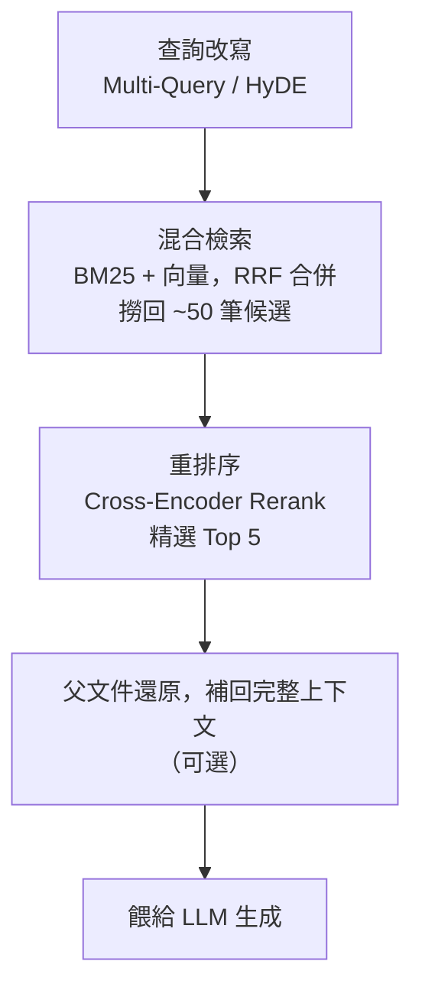

# 本篇重點

[Ep-1](/posts/langchain-與-llm-學習筆記-ep-1) 我們把 RAG 的骨架搭起來了，但「能跑」跟「準確」是兩回事。這篇要深入兩件事：

1. **怎麼讓檢索更準** —— 從分割、混合檢索、查詢改寫、重排序到 Anthropic 的上下文檢索（Contextual Retrieval）。
2. **怎麼處理多模態檔案** —— 當文件裡有圖片、表格、掃描檔、流程圖時，純文字向量的 RAG 該怎麼進化。

<!-- more -->

---

## 一、為什麼 RAG 檢索會「不準」？

在動手優化之前，先搞清楚問題出在哪。RAG 答錯，幾乎都不是 LLM 的錯，而是**「餵給它的資料就錯了」**。常見的失敗模式有三種：

- **撈不到（Recall 太低）**：答案明明在知識庫裡，但對的 chunk 沒被檢索出來。通常是分割切壞了、或語意向量抓不到關鍵字（例如專有名詞、產品型號）。
- **撈太多雜訊（Precision 太低）**：Top-k 撈回來一堆「看起來相關、其實沒用」的片段，稀釋了真正的答案，LLM 反而被帶偏。
- **chunk 失去上下文**：一段話被切下來後，「它」、「該方案」、「上述條件」這些指代詞失去了原文脈絡，向量化之後語意整個跑掉。

> 一句話總結：**檢索品質 = 你的 RAG 上限。** 後面所有技巧，都是在攻擊上面這三個問題。

下面我把優化技巧依照 Ep-1 的「索引階段」與「查詢階段」分開講，這樣你會很清楚每招是動到流程的哪一段。

---

## 二、索引階段的優化：切得好，才檢索得好

### 1. 別再用固定長度硬切 —— 語意分割與父子分割

Ep-1 提到最陽春的切法是「固定字數 + overlap」，但這很容易把一個完整概念從中間劈開。進階做法有兩種：

**語意分割（Semantic Chunking）**：不看字數，而是看「語意是否連續」。它會逐句計算向量相似度，當相鄰句子的語意距離突然變大（代表話題轉換），就在那裡切一刀。

```python
from langchain_experimental.text_splitter import SemanticChunker
from langchain_openai import OpenAIEmbeddings

splitter = SemanticChunker(
    OpenAIEmbeddings(model="text-embedding-3-small"),
    breakpoint_threshold_type="percentile",  # 用百分位數決定切點
)
docs = splitter.create_documents([long_text])
```

**父子分割（Parent Document Retriever）**：這招很關鍵。核心矛盾是——**chunk 切小一點，檢索比較準；但 chunk 太小，餵給 LLM 的上下文又不夠。** 父子分割同時拿到兩者的好處：

- **檢索時**用「小 chunk」（子文件）去比對，命中率高、雜訊少。
- **餵給 LLM 時**回傳該 chunk 所屬的「大段落」（父文件），確保上下文完整。

> 📦 **LangChain v1 套件提醒**：從 LangChain 1.0 起，核心 `langchain` 套件只保留 `init_chat_model`、`create_agent` 等 agent 基礎元件，本篇用到的各種 retriever（`ParentDocumentRetriever`、`EnsembleRetriever`、`MultiQueryRetriever`、`ContextualCompressionRetriever`）都已移到 **`langchain-classic`** 套件。請先 `pip install langchain-classic`，並從 `langchain_classic.retrievers` 匯入。

```python
from langchain_classic.retrievers import ParentDocumentRetriever

retriever = ParentDocumentRetriever(
    vectorstore=vectorstore,        # 存小 chunk 的向量
    docstore=store,                 # 存大段落原文
    child_splitter=child_splitter,  # 切小（如 400 字）
    parent_splitter=parent_splitter # 切大（如 2000 字）
)
```

### 2. 上下文檢索（Contextual Retrieval）—— Anthropic 2024 的關鍵改進

這是目前性價比最高的一招。前面提到「chunk 被切下來會失去脈絡」，Anthropic 的解法簡單到有點暴力：

> **在每個 chunk 嵌入之前，先用一個便宜的 LLM 幫它生成一段 50–100 字的「上下文說明」，描述這個片段在整份文件裡的位置與意義，然後把這段說明黏在 chunk 前面再做嵌入。**

舉例，原始 chunk 是：

```
該公司營收較上一季成長 3%。
```

加上上下文後變成：

```
（本段出自 ACME 公司 2024 年第二季財報，討論季度營收表現）
該公司營收較上一季成長 3%。
```

這樣即使使用者問「ACME 第二季營收成長多少」，這個 chunk 也能被精準命中。Anthropic 的實測數據很有說服力：

| 方法 | Top-20 檢索失敗率下降 |
| :--- | :--- |
| 純語意嵌入（baseline） | — |
| + 上下文嵌入 | **−35%** |
| + 上下文嵌入 + 上下文 BM25 | **−49%** |
| 再 + 重排序（Reranking） | **−67%** |

代價是建索引時要對每個 chunk 多跑一次 LLM，但搭配 prompt caching 成本可以壓很低，而且這是**離線一次性成本**，非常划算。

---

## 三、查詢階段的優化：撈得廣，再排得準

### 1. 混合檢索（Hybrid Search）—— 語意 + 關鍵字，兩個都要

純向量檢索有個致命弱點：**對「精確字詞」很弱**。當使用者搜尋產品型號 `RTX-4090`、錯誤碼 `ERR_0x80`、人名這類東西時，語意相似度反而不可靠——這正是傳統關鍵字檢索（BM25）的強項。

混合檢索就是**同時跑兩種檢索再合併**：

- **稀疏檢索（Sparse / BM25）**：擅長精確字詞匹配。
- **稠密檢索（Dense / 向量）**：擅長語意理解、同義詞。

兩邊各自排序後，用 **RRF（Reciprocal Rank Fusion，倒數排名融合）** 合併分數，取得一份兼顧「字面」與「語意」的清單。

```python
from langchain_classic.retrievers import EnsembleRetriever
from langchain_community.retrievers import BM25Retriever

bm25 = BM25Retriever.from_documents(docs)      # 關鍵字
bm25.k = 5
vector = vectorstore.as_retriever(search_kwargs={"k": 5})  # 語意

# weights 控制兩者的權重，可依資料特性調整
hybrid = EnsembleRetriever(retrievers=[bm25, vector], weights=[0.4, 0.6])
```

### 2. 查詢轉換（Query Transformation）—— 別讓爛問題拖垮檢索

使用者的提問常常很口語、很模糊，直接拿去檢索效果很差。幾種改寫策略：

- **Multi-Query（多重查詢）**：用 LLM 把一個問題改寫成多個角度的版本，分別檢索後合併去重，大幅提升 Recall。
- **HyDE（假設性文件嵌入）**：反直覺但很有效——先讓 LLM「**假裝**」生成一段答案，再用這段假答案去做向量檢索。因為「答案」在向量空間裡會比「問題」更靠近真正的答案文件。
- **查詢分解（Decomposition）**：把複雜的多跳問題（multi-hop）拆成數個子問題，逐一檢索再彙整，適合「A 和 B 的差異是什麼」這種需要多份資料的問題。

```python
from langchain_classic.retrievers.multi_query import MultiQueryRetriever
from langchain.chat_models import init_chat_model

retriever = MultiQueryRetriever.from_llm(
    retriever=vectorstore.as_retriever(),
    llm=init_chat_model("gpt-4o-mini", temperature=0),  # v1 統一的模型初始化
)
```

### 3. 重排序（Reranking）—— 檢索的「第二道把關」

這是 CP 值最高的精準度提升手段。前面的混合檢索負責**「廣撒網」**（撈回 50 筆候選，重 Recall），重排序則負責**「精挑細選」**（從 50 筆裡選出真正最相關的 5 筆，重 Precision）。

關鍵差別在於模型架構：

- **向量檢索用的是 Bi-Encoder**：問題與文件「分開」各自編碼成向量，快但粗略。
- **重排序用的是 Cross-Encoder**：把「問題 + 文件」**一起**丟進模型，直接判斷相關性分數，慢但精準。

所以策略是：用便宜快速的 Bi-Encoder 先粗篩一大批，再用昂貴精準的 Cross-Encoder 對這一小批做精排。

```python
from langchain_classic.retrievers import ContextualCompressionRetriever
from langchain_cohere import CohereRerank

compressor = CohereRerank(model="rerank-v3.5", top_n=5)  # 從候選中精選 5 筆
retriever = ContextualCompressionRetriever(
    base_compressor=compressor,
    base_retriever=hybrid,  # 接在前面的混合檢索後面
)
```

### 把這些組起來：一條進階檢索管線

實務上的高準確度 RAG，檢索段大概長這樣：



不用一次全上。**投資報酬率排序我會建議：先做「重排序」與「混合檢索」（最有感），行有餘力再加「上下文檢索」與「查詢改寫」。**

---

## 四、多模態 RAG：當檔案不只有文字

前面講的都是純文字。但真實世界的 PDF、簡報、財報裡塞滿了**表格、圖表、流程圖、掃描影像**——這些資訊用傳統「文字抽取 → 嵌入」的流程會直接遺失。多模態 RAG 就是要把這些「看得懂」。目前主流有三種架構，由淺入深：

### 架構 A：圖片轉文字描述（Captioning）—— 最務實的起手式

**做法**：在索引階段，先用一個多模態 LLM（如 GPT-4o、Claude）幫每張圖片 / 表格生成詳細的文字描述（caption），然後**只對這段文字做嵌入**，但保留原圖的指標。檢索命中時，再把原圖一起餵給生成模型。

- **優點**：完全沿用既有的文字 RAG 管線，最容易導入；表格、圖表的描述品質高。
- **缺點**：描述會遺漏細節（caption 寫不到的東西就檢索不到）；索引成本高（每張圖跑一次 VLM）。

```python
# 索引階段：對每張圖生成描述
from langchain_openai import ChatOpenAI

vision = ChatOpenAI(model="gpt-4o")
summary = vision.invoke([{"role": "user", "content": [
    {"type": "text", "text": "詳細描述這張圖表的數據與趨勢，供日後檢索使用"},
    {"type": "image_url", "image_url": {"url": image_data_uri}},
]}])
# 把 summary 拿去嵌入，metadata 裡存原圖路徑
```

### 架構 B：統一多模態嵌入（CLIP 系）—— 圖文同一個向量空間

**做法**：使用像 CLIP、Nomic Embed Vision、Cohere Embed v4 這類模型，**把圖片和文字嵌入到「同一個向量空間」**。這樣一段文字查詢可以直接和圖片算相似度，圖文跨模態檢索。

- **優點**：能用文字直接搜圖（「找出顯示營收下滑的長條圖」），不需先轉述；檢索快。
- **缺點**：CLIP 這類模型對「圖片裡的密集文字 / 表格細節」理解較弱，比較適合自然圖像（照片、示意圖），不適合文字密集的文件頁。

### 架構 C：文件影像直接檢索（ColPali / ColQwen）—— 2024–2025 的突破

這是最前沿、也最適合**「文件型」資料**的做法。傳統流程要先做 OCR、版面分析、表格抽取，又慢又容易出錯。ColPali 的想法是**把整個流程砍掉**：

> **直接把「整頁文件」當成一張圖片，用視覺語言模型（VLM）編碼，完全跳過文字抽取與版面分析。**

它的技術核心有兩點：

- **視覺嵌入**：用 PaliGemma（ColPali）或 Qwen2-VL（ColQwen）把每頁切成多個 patch，每個 patch 都生成向量，同時保留**文字內容**與**視覺版面**資訊。
- **後期互動（Late Interaction）**：借鏡 ColBERT 的多向量機制——查詢的每個 token 向量會去和頁面所有 patch 向量比對取最大相似度再加總，比單一向量更能抓到細節對應。

```python
# 概念示意（使用 colpali-engine）
from colpali_engine.models import ColQwen2, ColQwen2Processor

model = ColQwen2.from_pretrained("vidore/colqwen2-v1.0")
processor = ColQwen2Processor.from_pretrained("vidore/colqwen2-v1.0")

# 索引：直接把 PDF 每一頁當圖片編碼，不需要 OCR
page_embeddings = model(**processor.process_images(pdf_page_images))
# 查詢：文字 query 編碼後，用 late interaction 比對
query_embeddings = model(**processor.process_queries(["第二季毛利率是多少？"]))
```

- **優點**：對表格、圖表、掃描檔、複雜版面的文件效果極佳；省掉整個 OCR / parsing 前處理，索引反而更簡單。
- **缺點**：多向量儲存空間較大（每頁好幾千個向量）；需要 GPU；生態還在成熟中。

### 三種架構怎麼選？

| 架構 | 最適合的資料 | 導入難度 | 檢索品質 |
| :--- | :--- | :--- | :--- |
| **A. 圖片轉述** | 既有文字 RAG 想加圖片支援 | 低 | 中（受描述品質限制） |
| **B. CLIP 統一嵌入** | 自然圖像、產品照、示意圖 | 中 | 中（密集文字較弱） |
| **C. ColPali / ColQwen** | 財報、論文、掃描檔等文件型 PDF | 高（需 GPU） | 高 |

> 實務建議：**想快速上線、資料以一般文件為主 → 先用架構 A；資料是大量複雜版面的 PDF（財報、合約、論文）且你有 GPU → 直上架構 C。**

---

## 小結

這篇我們把 RAG 從「能跑」推到「夠準、夠全」：

- **精準度**：索引階段用「父子分割 + 上下文檢索」保住脈絡；查詢階段用「混合檢索撈得廣 → 重排序排得準」，再用查詢改寫補強模糊提問。
- **多模態**：依資料型態選擇「圖片轉述 / CLIP 統一嵌入 / ColPali 文件影像檢索」，讓 RAG 看得懂表格與圖。

下一篇 [Ep-3](/posts/langchain-與-llm-學習筆記-ep-3) 我們就動手把這條進階管線**實際用 LangChain 串起來、跑一個能查 PDF（含圖表）的完整範例**，把這兩篇的理論變成可以執行的程式碼。

---

## 延伸閱讀

- [Anthropic — Introducing Contextual Retrieval](https://www.anthropic.com/news/contextual-retrieval)
- [ColPali: Efficient Document Retrieval with Vision Language Models (arXiv 2407.01449)](https://arxiv.org/abs/2407.01449)
- [Multimodal Document RAG with Llama 3.2 Vision and ColQwen2 — Together AI](https://www.together.ai/blog/multimodal-document-rag-with-llama-3-2-vision-and-colqwen2)
- [Optimizing RAG with Hybrid Search & Reranking — VectorHub](https://superlinked.com/vectorhub/articles/optimizing-rag-with-hybrid-search-reranking)
- [LangChain v1 Quickstart 官方文件](https://docs.langchain.com/oss/python/langchain/quickstart)
- [LangChain v1 Migration Guide（retrievers 已移至 langchain-classic）](https://docs.langchain.com/oss/python/migrate/langchain-v1)
