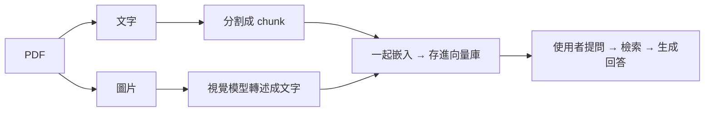

## 本篇重點

[Ep-2](/posts/langchain-與-llm-學習筆記-ep-2) 把進階檢索的每個技術都實作過了——語意分割、混合檢索、重排序、上下文檢索。但那些都是純文字。這篇要處理 Ep-2 沒碰到的東西：**當文件裡有圖片、表格、掃描檔時，純文字向量的 RAG 該怎麼進化**。

我們要做一個能讀「含圖表 PDF」的 RAG 系統，而且全部用**本地的 Ollama 模型**跑，不花一毛 API 錢。架構選的是最務實的「**圖片轉述（Captioning）**」那一套。

<!-- more -->

---

## 我們要解決什麼問題？

回想一下 Ep-1 的流程：載入 PDF → 抽文字 → 分割 → 嵌入。問題是——**這個流程只看得到「文字」**。當你的 PDF 是一份財報、裡面有一張「季度營收長條圖」，傳統做法會直接把那張圖丟掉，於是使用者問「第三季營收趨勢如何」，RAG 永遠答不出來，因為那個資訊根本沒進到資料庫裡。

「圖片轉述」的解法很直覺：

> **在索引階段，先用一個看得懂圖的視覺模型，把每張圖「講成一段文字」，再把這段文字拿去嵌入。** 這樣圖裡的資訊就變成可以被檢索的文字了。

整條管線長這樣：



---

## 一、環境準備

沿用系列同一個 repo，clone 下來、`uv sync` 就把這篇要用的套件（`pymupdf`、`langchain-chroma`、`langchain-ollama` 等）一次裝好，不用另外 `uv add`：

```bash
git clone https://github.com/Peter-To-Better/langchain-rag-lab.git
cd langchain-rag-lab && uv sync
```

### 準備 Ollama 模型

如果還沒裝 Ollama，先去[官網](https://ollama.com/)下載安裝。這篇比前兩篇多一個視覺模型，把三個都拉下來：

```bash
ollama pull qwen2.5vl:7b      # 視覺模型：負責「看圖說故事」（這篇新增）
ollama pull llama3.1          # 一般語言模型：負責最後生成回答
ollama pull nomic-embed-text  # 嵌入模型：負責把文字轉成向量
```

> ⚠️ **視覺模型選 `qwen2.5vl`，不是 `llama3.2-vision`**：Ollama 新版引擎（v0.30.0+）已經不支援 `llama3.2-vision` 用的 `mllama` 架構，直接載入會報 `unknown model architecture: 'mllama'` 然後掛掉（[ollama/ollama#16547](https://github.com/ollama/ollama/issues/16547)）。這是 Ollama 官方的已知 regression，不是你的環境有問題。`qwen2.5vl` 是新引擎正式支援的視覺模型，這篇全部改用它。
>
> 為什麼嵌入要用專門的 `nomic-embed-text`，而不是直接拿 `llama3.1`？因為**嵌入跟生成是兩種不同的任務**，專門的嵌入模型體積小、速度快，產出的向量品質也更適合做語意檢索。

---

## 示範文件：真的有圖表的政府報告

Ep-1 用報稅 PDF、Ep-2 用勞動基準法，這篇需要一份**PDF 裡真的內嵌圖表**的文件——這點比想像中挑：很多報告的長條圖、折線圖其實是 Excel / PowerPoint 圖表物件轉存的**向量圖**，不是圖片，PyMuPDF 的 `page.get_images()` 抓不到，丟進這篇的管線會是 0 張圖。

這篇用的是**衛生福利部疾病管制署《傳染病統計暨監視年報－113年》**（[官方頁面](https://www.cdc.gov.tw/InfectionReport/List/DRiONFTwYxu8T162Hm6yFw)）——202 頁、106 張真的內嵌點陣圖片（各傳染病的縣市發生率地理分布圖、趨勢長條圖），政府公開資料，跟 Ep-1、Ep-2 一樣沒有版權疑慮，每年到流感、腸病毒、登革熱季節也真的會有人搜尋。

```bash
curl -L -o infection-report.pdf \
  "https://www.cdc.gov.tw/Uploads/infectionreport/5f6d88aa-760c-4f04-ba10-688c5479b2c1.pdf"
```

完整 202 頁對這篇的教學來說**太大**——它有 30 幾種疾病、每種疾病的地理分布圖長得幾乎一樣（只有顏色數值不同），這會在後面製造一個很有意思的失敗案例（[進階：完整 202 頁報告會發生什麼事](#進階完整-202-頁報告會發生什麼事)）。教學主線改用其中**麻疹（measles）章節**這 4 頁（疫情描述文字 + 2 張趨勢圖 + 1 張縣市地理分布圖），語料小、聚焦，適合驗證架構本身有沒有跑對：

```python
import fitz

src = fitz.open("infection-report.pdf")
out = fitz.open()
out.insert_pdf(src, from_page=81, to_page=84)  # 麻疹章節：印刷頁 76–79
out.save("measles-chapter.pdf")
```

```bash
uv run python -c "
import fitz
src = fitz.open('infection-report.pdf')
out = fitz.open()
out.insert_pdf(src, from_page=81, to_page=84)
out.save('measles-chapter.pdf')
"
```

後面所有程式碼範例都是實際對這份 `measles-chapter.pdf` 跑出來的結果，程式碼收在 repo 的 [`ep3_multimodal_rag/`](https://github.com/Peter-To-Better/langchain-rag-lab/tree/main/ep3_multimodal_rag) 資料夾。

---

## 二、把 PDF 拆成「文字」與「圖片」

第一步是把 PDF 裡的文字跟圖片分別抽出來。這裡用 **PyMuPDF**（套件名是 `pymupdf`，但 import 時叫 `fitz`），它抽圖、抽文字都很快。

```python
import fitz  # PyMuPDF

def extract_pdf(pdf_path: str, image_dir: str = "images"):
    import os
    os.makedirs(image_dir, exist_ok=True)

    doc = fitz.open(pdf_path)
    texts, image_paths = [], []

    for page_num, page in enumerate(doc):
        # 1. 抽這一頁的文字
        text = page.get_text().strip()
        if text:
            texts.append({"page": page_num, "content": text})

        # 2. 抽這一頁的所有圖片
        for img_index, img in enumerate(page.get_images(full=True)):
            xref = img[0]
            pix = fitz.Pixmap(doc, xref)
            if pix.n > 4:  # CMYK 先轉成 RGB
                pix = fitz.Pixmap(fitz.csRGB, pix)
            path = f"{image_dir}/p{page_num}_{img_index}.png"
            pix.save(path)
            image_paths.append({"page": page_num, "path": path})

    return texts, image_paths
```

對應 repo 裡的 [`pdf_parser.py`](https://github.com/Peter-To-Better/langchain-rag-lab/blob/main/ep3_multimodal_rag/pdf_parser.py)，可以直接跑：

```bash
uv run python ep3_multimodal_rag/pdf_parser.py measles-chapter.pdf
```

執行結果：

```text
✓ 抽取完成：4 頁文字、3 張圖片
```

跑完之後，你會拿到兩疊東西：一疊純文字、一疊存成 PNG 的圖片（預設存在 `./images`）。

---

## 三、讓視覺模型「看圖說故事」

接下來是這篇的核心：把每張圖丟給 `qwen2.5vl:7b`，請它生成一段**詳細的文字描述**。描述寫得越完整，之後越檢索得到，所以 prompt 要明確要求它把「數據、趨勢、圖表類型」都講出來。

```python
import base64
from langchain_ollama import ChatOllama
from langchain_core.messages import HumanMessage

vision = ChatOllama(model="qwen2.5vl:7b", temperature=0)

def caption_image(image_path: str) -> str:
    with open(image_path, "rb") as f:
        img_b64 = base64.b64encode(f.read()).decode("utf-8")

    message = HumanMessage(content=[
        {
            "type": "text",
            "text": "你是一個文件分析助理。請詳細描述這張圖片的內容，"
                    "如果是圖表，請說明它的類型、座標軸代表什麼、"
                    "數據的數值與趨勢。描述會被用於後續的語意檢索，請盡量完整。",
        },
        {"type": "image_url", "image_url": f"data:image/png;base64,{img_b64}"},
    ])
    return vision.invoke([message]).content
```

對應 repo 裡的 [`caption.py`](https://github.com/Peter-To-Better/langchain-rag-lab/blob/main/ep3_multimodal_rag/caption.py)，可以對單張圖片直接跑：

```bash
uv run python ep3_multimodal_rag/caption.py images/p2_0.png
```

`p2_0.png` 就是上一步從 `measles-chapter.pdf` 抽出來的「104 年至 113 年麻疹確定病例趨勢圖」。實際對它跑一次，`qwen2.5vl:7b` 真的轉述出來的內容是（節錄）：

```text
這張圖片是一張柱狀圖，顯示了不同年份（發病年）的病例數。

X軸：表示發病年的年份，從104年至113年。
Y軸：表示病例數，單位為個案（個），範圍從0到約175。

各數據點的數值與整體趨勢：
- 年份104年有29個病例。
- 年份108年有141個病例，是所有年份中最高的。
- 年份109年和112年沒有病例（數據為0）。
- 年份113年有32個病例。

整體上，從104年至108年的病例數逐漸增加，其中以108年為最高峯...
```

軸、圖表類型、每個數據點的數值都讀出來了——這段文字一旦進了向量庫，使用者問「哪一年病例數最多」就檢索得到了。

---

## 四、文字與圖片描述，一起入庫

現在把「文字 chunk」跟「圖片描述」統一包成 LangChain 的 `Document`，一起做嵌入存進 Chroma。關鍵在於**圖片描述的 `metadata` 要記住原圖路徑**，這樣生成回答時才能告訴使用者「這個答案是根據第 3 頁的那張圖」。

```python
from langchain_core.documents import Document
from langchain_text_splitters import RecursiveCharacterTextSplitter
from langchain_chroma import Chroma
from langchain_ollama import OllamaEmbeddings

texts, image_paths = extract_pdf("measles-chapter.pdf")

# 文字切塊
splitter = RecursiveCharacterTextSplitter(chunk_size=500, chunk_overlap=80)
docs = []
for t in texts:
    for chunk in splitter.split_text(t["content"]):
        docs.append(Document(page_content=chunk,
                             metadata={"type": "text", "page": t["page"]}))

# 圖片 → 轉述 → 也變成一份 Document
for img in image_paths:
    caption = caption_image(img["path"])
    docs.append(Document(
        page_content=caption,
        metadata={"type": "image", "page": img["page"], "source_image": img["path"]},
    ))

# 一起嵌入入庫
embeddings = OllamaEmbeddings(model="nomic-embed-text")
vectorstore = Chroma.from_documents(docs, embeddings, persist_directory="./chroma_db")
```

到這裡，**文字和圖片已經活在同一個向量空間裡了**，檢索的時候它們會公平競爭，誰跟問題比較相關就誰被撈出來——但這裡藏了一個第一次跑實測時才發現的坑。

### 圖片轉述看得到「畫面裡有什麼」，看不到「這張圖是誰」

拿麻疹的縣市地理分布圖實測，`qwen2.5vl:7b` 轉述出來的內容像這樣：

```text
這張圖片是一張地圖，顯示了臺灣省及其周邊地區的行政區劃，
並使用不同顏色來表示數據值的範圍。臺北市：數據值較高。
新北市：數據值較高。基隆市：數據值較低...
```

問題來了：**整段轉述完全沒有「麻疹」兩個字。** 因為圖片本身就是一張純粹的著色地圖，畫面裡沒有任何文字寫著這是麻疹的地圖——那個資訊只存在於同一頁的圖說「圖四 113 年**麻疹**確定病例發生率地理分布圖」，而圖說是頁面上的文字，不是圖片內容，視覺模型看不到。

結果就是：問「麻疹哪個縣市發生率最高」，這段轉述在向量空間裡完全搭不上「麻疹」兩個字，檢索直接撈空。**這正是 Ep-2 講的「chunk 失去上下文」，只是這次失去的不是段落上下文，是圖片的身分。** 解法也一樣：把該頁的文字接在轉述前面一起嵌入，等於幫圖片補回「它是什麼」的上下文：

```python
# 圖片 → 轉述 → 接上同頁文字 → 才變成一份 Document
page_text_lookup = {t["page"]: t["content"] for t in texts}
for img in image_paths:
    caption = caption_image(img["path"])
    nearby_text = page_text_lookup.get(img["page"], "").strip()
    page_content = f"{nearby_text}\n\n{caption}" if nearby_text else caption
    docs.append(Document(
        page_content=page_content,
        metadata={"type": "image", "page": img["page"], "source_image": img["path"]},
    ))
```

對應 repo 裡的 [`build_index.py`](https://github.com/Peter-To-Better/langchain-rag-lab/blob/main/ep3_multimodal_rag/build_index.py)（已經是修好上下文那版），跑起來會把文字跟三張圖片描述一起嵌入、存成 Chroma 索引：

```bash
uv run python ep3_multimodal_rag/build_index.py measles-chapter.pdf
```

執行結果：

```text
✓ 抽取完成：4 頁文字、3 張圖片
  [圖片 1/3] 轉述中：./images/p2_0.png
  [圖片 2/3] 轉述中：./images/p2_1.png
  [圖片 3/3] 轉述中：./images/p3_0.png

建立索引中（共 9 筆文件）...
✓ 索引建立完成，已儲存至 ./chroma_db
```

> ⚠️ 這招在頁面**只有一張圖**時很乾淨，但如果一頁塞了好幾張圖（麻疹章節那頁就有兩張趨勢圖），全頁文字會被兩張圖共用，可能造成新的混淆——[進階案例](#進階完整-202-頁報告會發生什麼事)會示範這具體會怎麼出包。理想做法是只接「緊鄰該圖的圖說那一行」，不是整頁文字，但這篇先用最簡單的版本示範概念。

---

## 五、檢索並生成回答

最後一步，把問題拿去檢索，再交給 `llama3.1` 生成回答。跟 Ep-1 一樣，用最直白的方式串起來，不用任何額外框架：

```python
from langchain_ollama import ChatOllama
from langchain_core.prompts import ChatPromptTemplate

retriever = vectorstore.as_retriever(search_kwargs={"k": 9})
llm = ChatOllama(model="llama3.1", temperature=0)

prompt = ChatPromptTemplate.from_template(
    "你是一個文件問答助理，只能根據以下參考資料回答問題，"
    "不確定就直接說不知道，不要補充資料以外的內容。\n\n"
    "參考資料：\n{context}\n\n問題：{question}"
)

def format_docs(docs):
    parts = []
    for d in docs:
        tag = "（來自圖片）" if d.metadata["type"] == "image" else ""
        parts.append(f"[第 {d.metadata['page']} 頁]{tag} {d.page_content}")
    return "\n\n".join(parts)

question = "113年麻疹確定病例發生率最高的縣市是哪裡？"
context = format_docs(retriever.invoke(question))
answer = llm.invoke(prompt.format(context=context, question=question))
print(answer.content)
```

對應 repo 裡的 [`query.py`](https://github.com/Peter-To-Better/langchain-rag-lab/blob/main/ep3_multimodal_rag/query.py)，也可以透過 [`pipeline.py`](https://github.com/Peter-To-Better/langchain-rag-lab/blob/main/ep3_multimodal_rag/pipeline.py) 一次跑完「建索引 + 問答」。第一次照這個邏輯直接跑（`top_k` 用預設值 4）：

```bash
uv run python ep3_multimodal_rag/pipeline.py \
  --pdf measles-chapter.pdf \
  --question "113年麻疹確定病例發生率最高的縣市是哪裡？"
```

執行結果：

上面這段程式碼看起來平淡無奇，但**第一次照著這個邏輯跑，答案是「不知道」**——即使 `measles-chapter.pdf` 這份文件裡明明白白寫著「每十萬人口確定病例發生率以**彰化縣 1.05 居冠**」：


追下去發現是兩層問題疊在一起，跟大家老實交代：

**第一層：prompt 的措辭會真的影響模型敢不敢回答。** 一開始用的是這樣的 prompt：

```text
如果資料中找不到答案，請明確說「根據目前的文件，我找不到相關資訊」。
```

把「彰化縣 1.05 居冠」那一段文字**單獨**餵給 `llama3.1`（context 裡什麼干擾都沒有，答案就在裡面），配這句 prompt，模型還是回「找不到相關資訊」。換成 Ep-1 那句更簡短的版本——

```text
不確定就直接說不知道，不要補充資料以外的內容。
```

——同樣的 context、同樣的問題，馬上答對「彰化縣」。兩句話語意幾乎一樣，但前者「明確要求覆誦某句拒答話術」這個寫法，會讓 `llama3.1` 對中文指令更容易過度保守、傾向直接套用那句話收場，即使答案就在眼前。**這是這篇唯一改動 prompt 措辭、其他邏輯完全沒動就修好的坑**，也是為什麼上面的程式碼用的是 Ep-1 那句，不是最初寫的那句。

**第二層：`top_k` 要跟語料庫大小成比例，不是憑感覺設一個固定值。** 修完 prompt，用預設的 `k=4` 再跑一次，答案還是「不知道」——這次是真的檢索沒撈到，因為 `measles-chapter.pdf` 分割完只有 9 份文件，`k=4` 連一半都不到，剛好把「彰化縣 1.05 居冠」那一段文字排除在外（那頁文字被 `RecursiveCharacterTextSplitter` 切成兩塊，恰好撈到沒有排名資訊的那一塊）。把 `k` 調到 9（幾乎等於「全部給我」），這次才真的檢索到、也答對了。**語料庫只有個位數文件時，`k=4` 這種寫死的預設值本身就是一個隱形的坑**——這篇用小文件示範，「調大 top_k」是誠實的作法，不是作弊；正式場景语料庫更大時，`k=4` 才會是合理起點。

兩個坑都修完，用同一份已建好的索引、把 `top_k` 調到 9 重跑：

```bash
uv run python ep3_multimodal_rag/pipeline.py \
  --question "113年麻疹確定病例發生率最高的縣市是哪裡？" \
  --top-k 9
```

執行結果：


`qwen2.5vl:7b` 把地圖轉述成文字、`nomic-embed-text` 把它跟同頁的圖說一起嵌入、`llama3.1` 從檢索到的 9 份文件裡揪出正確答案——**一個純文字 RAG（沒有這張地圖轉述）永遠答不出來的問題，這次是真的搞定了，不是憑空宣稱。**

---

## 進階：完整 202 頁報告會發生什麼事

上面的 `measles-chapter.pdf` 只有 4 頁、3 張圖，證明了架構本身能跑。但這篇原本的野心是對整份 202 頁、106 張圖的《傳染病統計暨監視年報》跑同一個問題——實測直接失敗，而且失敗的原因比「章節版」更深一層，值得記下來。

同一個問題「113年麻疹確定病例發生率最高的縣市是哪裡？」，對完整 202 頁跑（記得先用 `curl` 把 `infection-report.pdf` 下載回來，指令見[前面環境準備](#一環境準備)）：

```bash
uv run python ep3_multimodal_rag/pipeline.py \
  --pdf infection-report.pdf \
  --question "113年麻疹確定病例發生率最高的縣市是哪裡？"
```

> ⚠️ 106 張圖全部要跑一次視覺模型轉述，這步會花不少時間，跑之前先有心理準備。

執行結果：就算加了[上面那招上下文修正](#四文字與圖片描述一起入庫)，答案還是「找不到相關資訊」：


用 `similarity_search_with_score` 把正確答案（麻疹地理分布圖那份文件）在全部 501 份文件裡的排名抓出來——**它連前 20 名都排不進去**：

```text
1. score=0.3200  腸病毒 就診人次段落
2. score=0.3340  瘧疾 疫情描述段落
3. score=0.3354  麻疹地理分布圖的圖說（純文字，沒有數據）
4. score=0.3406  百日咳趨勢圖
...（正確的麻疹地圖轉述，20 名內完全沒出現）
```

原因是這份報告有**30 幾種疾病、每種疾病都有一張地理分布圖**，`qwen2.5vl:7b` 對每一張的轉述用詞高度相似（「這張圖片是一張地圖...顏色編碼...臺北市：數據值較高」），「麻疹」兩個字在一份近 800 字、九成是通用地圖描述語言的文件裡，稀釋到向量幾乎抓不住。

那換 Ep-2 的另一招——BM25 關鍵字檢索呢？一樣失敗，但失敗的原因完全不同：**麻疹章節那頁（印刷頁 78）塞了兩張趨勢圖，共用同一段「麻疹確定病例」文字兩次**；地理分布圖那頁（印刷頁 79）只提到一次。BM25 看字頻，兩次贏一次，於是排名最高的變成**趨勢圖**（回答不了「哪個縣市」），真正該找的地圖反而落後。

**這件事告訴我們什麼**：Ep-2 的混合檢索、重排序不是萬靈丹，前提是每個 chunk 的內容本身要有清楚的身分——這份報告「一頁多圖、圖說模板高度相似」的結構，會讓上下文修正這招失去精準度（幫錯的圖也補了同樣的上下文）。真正的修法要更細緻：**每張圖只接緊鄰它的那一行圖說（不是整頁），而不是像這篇示範版一樣整頁塞給每張圖**——這就是為什麼章節版的 demo 之所以能成功，關鍵不只是「語料變小」，也是因為 4 頁裡剛好每頁的圖說對應關係還算單純。真實世界的多模態 RAG，往往要在「語料大小」跟「圖說精準度」兩邊都下功夫，不能只解決一邊。

---

## 踩雷筆記

實作過程中幾個會卡住的地方，先幫你預告：

- **跑出 `unknown model architecture: 'mllama'` 然後整支腳本掛掉**：代表你裝的是 `llama3.2-vision`。Ollama 新版引擎（v0.30.0+）已經不支援它背後的 `mllama` 架構，這是官方已知 regression（[ollama/ollama#16547](https://github.com/ollama/ollama/issues/16547)），不是你裝錯或環境有問題。改拉 `qwen2.5vl:7b` 就好，程式碼裡把 model 名稱換掉即可，其他邏輯不用動。
- **`qwen2.5vl:7b` 第一次跑很慢**：模型要載入記憶體，第一張圖可能等十幾秒，後面就快了。圖片多的時候建議把轉述結果存檔（cache），不要每次重跑。
- **轉述品質取決於 prompt**：如果只丟「描述這張圖」，本地模型常常只給一句空泛的話。一定要在 prompt 裡明確要求「數據、座標軸、趨勢」，差很多。
- **掃描檔（整頁是圖）也適用**：如果你的 PDF 是掃描的，`page.get_text()` 會抽不到字，這時整頁其實就是一張圖，可以改成「把每一頁 render 成圖片」再丟給視覺模型，這也正好銜接 Ep-2 提到的 ColPali 思路。
- **本地模型記憶體**：`qwen2.5vl:7b` 雖然比 11B 版本輕，跑多張圖還是吃記憶體，機器不夠力可以先拿小一點的文件測試，或試試 `qwen2.5vl:3b`。
- **答案明明在 context 裡，模型還是回「找不到」**：先檢查 prompt 裡是不是有「請明確說『XXX』」這種指定拒答話術的句子——`llama3.1` 對這種寫法異常容易照抄，即使答案就在眼前。改用[更簡短的措辭](#五檢索並生成回答)（不指定拒答句、只說「不確定就說不知道」）通常就修好，不用動檢索邏輯。
- **小語料庫也會撈不到該有的答案**：`k=4` 是給「語料庫夠大」的場景用的預設值，如果你的示範文件切完只有個位數到十幾份文件，`k=4` 可能連一半都不到。文件量小的時候，直接把 `top_k` 調到接近文件總數，不算作弊。

---

## 小結

這篇把 Ep-2 的「圖片轉述」架構真的做出來了：**用 PyMuPDF 拆出圖片 → 用 Ollama 視覺模型轉述成文字 → 跟文字一起入庫 → 檢索生成**，整套跑在本地、零 API 成本。但老實說，第一次跑起來的過程遠不是這句話這麼平順——用真實政府報告實測，中間連續踩了三個坑才拿到正確答案：

1. **視覺模型本身失效**：`llama3.2-vision` 在新版 Ollama 上直接載入失敗，換 `qwen2.5vl:7b` 才解決。
2. **圖片轉述看不到自己是誰**：地圖轉述完全沒提到「麻疹」兩個字，因為那個資訊只存在於同頁的圖說文字裡，圖片畫面本身沒有——這是這篇最核心的架構坑，也是為什麼要把同頁文字接上圖片轉述再嵌入。
3. **prompt 措辭跟 `top_k` 大小，都會讓一個「架構正確」的系統答錯**：即使檢索邏輯完全沒問題，答案就在 context 裡，一句「請明確說『找不到』」的拒答指示，跟一個對小語料庫來說太保守的 `k=4`，都能讓 `llama3.1` 白白放棄一個它其實答得出來的問題。

三個坑沒有一個是「圖片轉述這招不管用」，但每一個都足以讓讀者照著文章跑、卻拿到跟文章不一樣的結果——這正是下一篇 [Ep-4](/posts/langchain-與-llm-學習筆記-ep-4) 要處理的問題：**光憑肉眼看幾個問答範例，很難分辨系統是「真的準」還是「這次剛好答對」**。怎麼用 RAGAS 量化評估、系統性抓出這類問題，用數據說話。

---

## 本篇程式碼

本篇的多模態 RAG 完整管線已整理成可直接執行的程式碼，拆成幾個小檔案，也可以單獨跑：

| 檔案 | 功能 | 執行指令 |
| :--- | :--- | :--- |
| `pdf_parser.py` | 從 PDF 抽取文字與圖片 | `uv run python ep3_multimodal_rag/pdf_parser.py measles-chapter.pdf` |
| `caption.py` | 用視覺模型把單張圖片轉述成文字 | `uv run python ep3_multimodal_rag/caption.py images/p2_0.png` |
| `build_index.py` | 文字 + 圖片轉述一起嵌入，建立 Chroma 索引 | `uv run python ep3_multimodal_rag/build_index.py measles-chapter.pdf` |
| `query.py` | 對已建好的索引提問（預設 `top_k=4`，可加第二個參數調整） | `uv run python ep3_multimodal_rag/query.py "113年麻疹確定病例發生率最高的縣市是哪裡？" 9` |
| `pipeline.py` | 一次跑完「建索引 + 問答」完整流程 | `uv run python ep3_multimodal_rag/pipeline.py --pdf measles-chapter.pdf --question "..." --top-k 9` |

👉 **[GitHub：langchain-rag-lab / ep3_multimodal_rag](https://github.com/Peter-To-Better/langchain-rag-lab/tree/main/ep3_multimodal_rag)**

跑完整個流程（示範文件用的是[前面提到的麻疹章節](#示範文件真的有圖表的政府報告)）：

```bash
git clone https://github.com/Peter-To-Better/langchain-rag-lab.git
cd langchain-rag-lab && uv sync
ollama pull qwen2.5vl:7b && ollama pull llama3.1 && ollama pull nomic-embed-text

curl -L -o infection-report.pdf \
  "https://www.cdc.gov.tw/Uploads/infectionreport/5f6d88aa-760c-4f04-ba10-688c5479b2c1.pdf"
uv run python -c "
import fitz
src = fitz.open('infection-report.pdf')
out = fitz.open()
out.insert_pdf(src, from_page=81, to_page=84)
out.save('measles-chapter.pdf')
"

uv run python ep3_multimodal_rag/pipeline.py \
  --pdf measles-chapter.pdf \
  --question "113年麻疹確定病例發生率最高的縣市是哪裡？" \
  --top-k 9
```

想看看[進階案例](#進階完整-202-頁報告會發生什麼事)裡「規模一大就失效」的實際狀況，把 `--pdf` 換成 `infection-report.pdf`（完整 202 頁）自己跑一次會更有感。

---

### 延伸閱讀

- [Ollama qwen2.5vl 模型頁](https://ollama.com/library/qwen2.5vl)
- [ollama/ollama#16547 — llama3.2-vision 在新引擎下的 mllama 架構問題](https://github.com/ollama/ollama/issues/16547)
- [LangChain — OllamaEmbeddings 官方文件](https://docs.langchain.com/oss/python/integrations/embeddings/ollama)
- [uv 官方文件](https://docs.astral.sh/uv/)
- [PyMuPDF 官方文件](https://pymupdf.readthedocs.io/)
