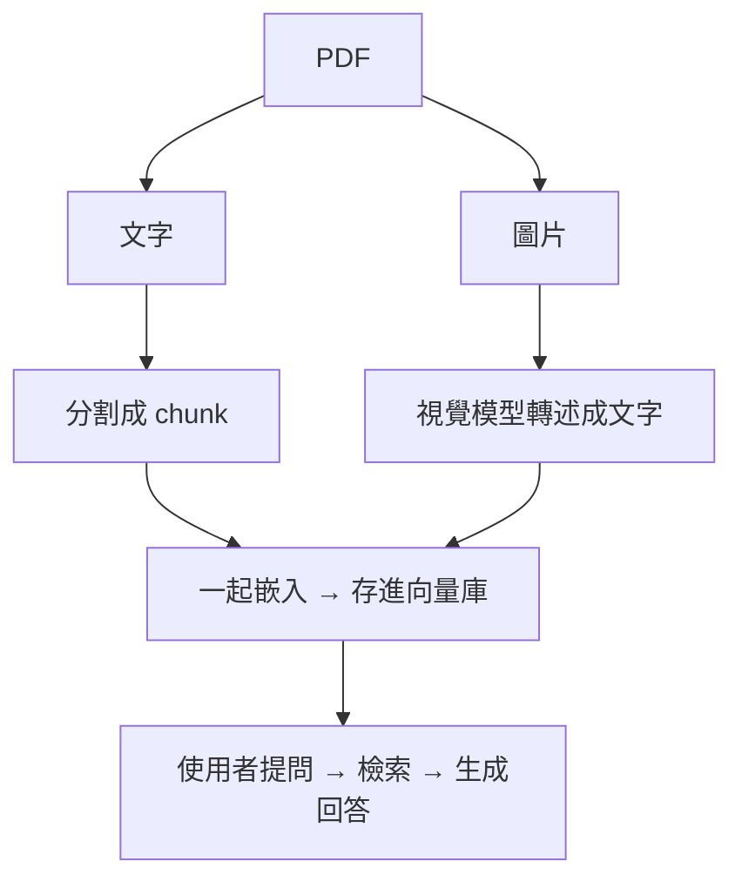

# 本篇重點

[Ep-2](/posts/langchain-與-llm-學習筆記-ep-2) 講了一堆進階 RAG 的理論，這篇終於要**動手了**。我們要做一個能讀「含圖表 PDF」的 RAG 系統，而且全部用**本地的 Ollama 模型**跑，不花一毛 API 錢。架構選的是 Ep-2 第四節提到、最務實的**「圖片轉述（Captioning）」**那一套。

<!-- more -->

---

## 我們要解決什麼問題？

回想一下 Ep-1 的流程：載入 PDF → 抽文字 → 分割 → 嵌入。問題是——**這個流程只看得到「文字」**。當你的 PDF 是一份財報、裡面有一張「季度營收長條圖」，傳統做法會直接把那張圖丟掉，於是使用者問「第三季營收趨勢如何」，RAG 永遠答不出來，因為那個資訊根本沒進到資料庫裡。

「圖片轉述」的解法很直覺：

> **在索引階段，先用一個看得懂圖的視覺模型，把每張圖「講成一段文字」，再把這段文字拿去嵌入。** 這樣圖裡的資訊就變成可以被檢索的文字了。

整條管線長這樣：



---

## 一、用 uv 建立專案

這次我們改用 **uv** 來管理專案，它是用 Rust 寫的 Python 套件管理工具，比 `pip + venv` 快非常多，而且一個指令就能把虛擬環境、相依管理全部搞定。

先初始化專案：

```bash
uv init langchain-rag-lab
cd langchain-rag-lab
```

`uv init` 會幫你產生 `pyproject.toml`、`.python-version` 跟一個範例 `main.py`，專案骨架就有了。接著裝套件，**注意這裡都用 `uv add`，不要用 `pip install`**，這樣相依關係才會被正確記錄到 `pyproject.toml` 裡：

```bash
# LangChain 核心 + v1 後搬家的 classic 套件
uv add langchain langchain-classic langchain-community

# 本地模型（Ollama）整合 + 向量庫 + PDF 處理
uv add langchain-ollama langchain-chroma pymupdf
```

> 📦 **接續 Ep-2 的提醒**：LangChain 1.0 之後，retriever 相關元件都搬到 `langchain-classic`，所以這裡要一起裝。

### 準備 Ollama 模型

如果還沒裝 Ollama，先去[官網](https://ollama.com/)下載安裝。接著把這次要用到的三個模型拉下來：

```bash
ollama pull llama3.2-vision   # 視覺模型：負責「看圖說故事」
ollama pull llama3.1          # 一般語言模型：負責最後生成回答
ollama pull nomic-embed-text  # 嵌入模型：負責把文字轉成向量
```

> 為什麼嵌入要用專門的 `nomic-embed-text`，而不是直接拿 `llama3.1`？因為**嵌入跟生成是兩種不同的任務**，專門的嵌入模型體積小、速度快，產出的向量品質也更適合做語意檢索。

---

## 二、把 PDF 拆成「文字」與「圖片」

第一步是把 PDF 裡的文字跟圖片分別抽出來。這裡用 **PyMuPDF**（套件名是 `pymupdf`，但 import 時叫 `fitz`），它抽圖、抽文字都很快。

```python
import fitz  # PyMuPDF

def extract_pdf(pdf_path: str, image_dir: str = "images"):
    import os
    os.makedirs(image_dir, exist_ok=True)

    doc = fitz.open(pdf_path)
    texts, image_paths = [], []

    for page_num, page in enumerate(doc):
        # 1. 抽這一頁的文字
        text = page.get_text().strip()
        if text:
            texts.append({"page": page_num, "content": text})

        # 2. 抽這一頁的所有圖片
        for img_index, img in enumerate(page.get_images(full=True)):
            xref = img[0]
            pix = fitz.Pixmap(doc, xref)
            if pix.n > 4:  # CMYK 先轉成 RGB
                pix = fitz.Pixmap(fitz.csRGB, pix)
            path = f"{image_dir}/p{page_num}_{img_index}.png"
            pix.save(path)
            image_paths.append({"page": page_num, "path": path})

    return texts, image_paths
```

跑完之後，你會拿到兩疊東西：一疊純文字、一疊存成 PNG 的圖片。

---

## 三、讓視覺模型「看圖說故事」

接下來是這篇的核心：把每張圖丟給 `llama3.2-vision`，請它生成一段**詳細的文字描述**。描述寫得越完整，之後越檢索得到，所以 prompt 要明確要求它把「數據、趨勢、圖表類型」都講出來。

```python
import base64
from langchain_ollama import ChatOllama
from langchain_core.messages import HumanMessage

vision = ChatOllama(model="llama3.2-vision", temperature=0)

def caption_image(image_path: str) -> str:
    with open(image_path, "rb") as f:
        img_b64 = base64.b64encode(f.read()).decode("utf-8")

    message = HumanMessage(content=[
        {
            "type": "text",
            "text": "你是一個文件分析助理。請詳細描述這張圖片的內容，"
                    "如果是圖表，請說明它的類型、座標軸代表什麼、"
                    "數據的數值與趨勢。描述會被用於後續的語意檢索，請盡量完整。",
        },
        {"type": "image_url", "image_url": f"data:image/png;base64,{img_b64}"},
    ])
    return vision.invoke([message]).content
```

舉例，一張季度營收長條圖，可能會被轉述成：

```
這是一張長條圖，X 軸為 2024 年的四個季度（Q1–Q4），
Y 軸為營收（單位：百萬）。Q1 約 120、Q2 約 135、Q3 約 160、
Q4 約 155，整體呈現上升趨勢，第三季達到全年最高點。
```

這段文字一旦進了向量庫，使用者問「第三季營收最高嗎」就檢索得到了。

---

## 四、文字與圖片描述，一起入庫

現在把「文字 chunk」跟「圖片描述」統一包成 LangChain 的 `Document`，一起做嵌入存進 Chroma。關鍵在於**圖片描述的 `metadata` 要記住原圖路徑**，這樣生成回答時才能告訴使用者「這個答案是根據第 3 頁的那張圖」。

```python
from langchain_core.documents import Document
from langchain_text_splitters import RecursiveCharacterTextSplitter
from langchain_chroma import Chroma
from langchain_ollama import OllamaEmbeddings

texts, image_paths = extract_pdf("report.pdf")

# 文字切塊
splitter = RecursiveCharacterTextSplitter(chunk_size=500, chunk_overlap=80)
docs = []
for t in texts:
    for chunk in splitter.split_text(t["content"]):
        docs.append(Document(page_content=chunk,
                             metadata={"type": "text", "page": t["page"]}))

# 圖片 → 轉述 → 也變成一份 Document
for img in image_paths:
    caption = caption_image(img["path"])
    docs.append(Document(
        page_content=caption,
        metadata={"type": "image", "page": img["page"], "source_image": img["path"]},
    ))

# 一起嵌入入庫
embeddings = OllamaEmbeddings(model="nomic-embed-text")
vectorstore = Chroma.from_documents(docs, embeddings, persist_directory="./chroma_db")
```

到這裡，**文字和圖片已經活在同一個向量空間裡了**，檢索的時候它們會公平競爭，誰跟問題比較相關就誰被撈出來。

---

## 五、檢索並生成回答

最後一步，把問題拿去檢索，再交給 `llama3.1` 生成回答。這裡用最直白的 LCEL 管線串起來：

```python
from langchain_ollama import ChatOllama
from langchain_core.prompts import ChatPromptTemplate

retriever = vectorstore.as_retriever(search_kwargs={"k": 4})
llm = ChatOllama(model="llama3.1", temperature=0)

prompt = ChatPromptTemplate.from_template(
    "你是一個文件問答助理，只能根據以下參考資料回答問題，"
    "不知道就說不知道。\n\n參考資料：\n{context}\n\n問題：{question}"
)

def format_docs(docs):
    parts = []
    for d in docs:
        tag = "（來自圖片）" if d.metadata["type"] == "image" else ""
        parts.append(f"[第 {d.metadata['page']} 頁]{tag} {d.page_content}")
    return "\n\n".join(parts)

question = "第三季的營收表現如何？"
context = format_docs(retriever.invoke(question))
answer = llm.invoke(prompt.format(context=context, question=question))
print(answer.content)
```

因為那張長條圖已經被轉述成文字入庫，這個問題就會檢索到圖片描述，`llama3.1` 也就能根據它回答「第三季營收約 160 百萬，是全年最高點」——**一個純文字 RAG 永遠答不出來的問題，現在搞定了。**

---

## 踩雷筆記

實作過程中幾個會卡住的地方，先幫你預告：

- **`llama3.2-vision` 第一次跑很慢**：模型要載入記憶體，第一張圖可能等十幾秒，後面就快了。圖片多的時候建議把轉述結果存檔（cache），不要每次重跑。
- **轉述品質取決於 prompt**：如果只丟「描述這張圖」，本地模型常常只給一句空泛的話。一定要在 prompt 裡明確要求「數據、座標軸、趨勢」，差很多。
- **掃描檔（整頁是圖）也適用**：如果你的 PDF 是掃描的，`page.get_text()` 會抽不到字，這時整頁其實就是一張圖，可以改成「把每一頁 render 成圖片」再丟給視覺模型，這也正好銜接 Ep-2 提到的 ColPali 思路。
- **本地模型記憶體**：`llama3.2-vision` 的 11B 版本吃滿不少 RAM，記憶體不夠的機器會很吃力，可以先拿小一點的文件測試。

---

## 小結

這篇我們把 Ep-2 的「圖片轉述」架構真的做出來了：**用 PyMuPDF 拆出圖片 → 用 Ollama 視覺模型轉述成文字 → 跟文字一起入庫 → 檢索生成**，整套跑在本地、零 API 成本。

但這裡有個尷尬的問題：**我們怎麼知道這個 RAG 到底準不準？** 加了圖片轉述以後，是真的變好，還是我自我感覺良好？這就是下一篇 [Ep-4](/posts/langchain-與-llm-學習筆記-ep-4) 要談的——**怎麼用 RAGAS 量化評估你的 RAG**，用數據說話。

---

## 本篇程式碼

本篇的多模態 RAG 完整管線已整理成可直接執行的程式碼：

👉 **[GitHub：langchain-rag-lab / ep3_multimodal_rag](https://github.com/Peter-To-Better/langchain-rag-lab/tree/main/ep3_multimodal_rag)**

一行指令跑完整個流程：
```bash
git clone https://github.com/Peter-To-Better/langchain-rag-lab.git
cd langchain-rag-lab && uv sync
ollama pull llama3.2-vision && ollama pull llama3.1 && ollama pull nomic-embed-text
uv run python ep3_multimodal_rag/pipeline.py --pdf your_report.pdf --question "第三季營收如何？"
```

---

## 延伸閱讀

- [Ollama llama3.2-vision 模型頁](https://ollama.com/library/llama3.2-vision)
- [LangChain — OllamaEmbeddings 官方文件](https://docs.langchain.com/oss/python/integrations/embeddings/ollama)
- [uv 官方文件](https://docs.astral.sh/uv/)
- [PyMuPDF 官方文件](https://pymupdf.readthedocs.io/)
